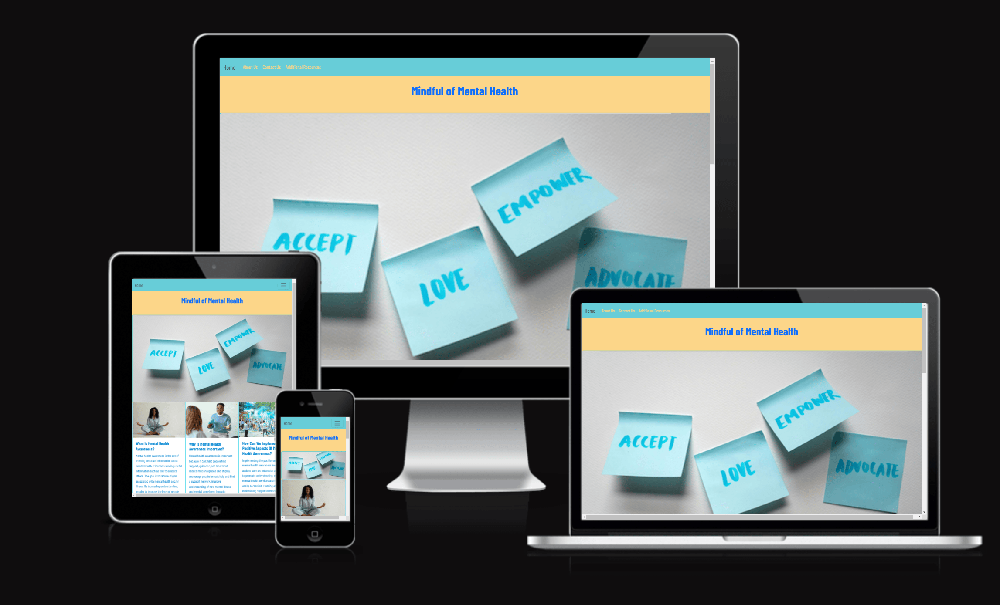

# Mindful of Mental Health | Asad Iqbal

## Code Institute - Individual Formative Assignment

### HTML/CSS Essentials/Bootstrap - Static Front-End Website

[Click Here to view the Live Project.](https://asad-1i.github.io/mental-health-awareness/)

[Click here to view the Repository.](https://github.com/Asad-1I/mental-health-awareness)

## The Why:

Create a welcoming webpage that provides basic mental health information and ability to contact those who are experienced with mental health awareness.

## (UX) User Experiance:

Mindful of Mental Health does not  have a specific target demographic, It is aimed at anyone and everyone. The aim of the site is to provide basic mental health awareness information in a simplistic way.

- ### The User

  - #### First Time User:
    - To be able to easily navigate the website and the content.
    - To have a better understanding on mental health and the positives of awareness.
  - #### Returning User:
    - To instantly know/remember how to navigate.
    - Find the information they require within as few actions as possible.
  - #### Issues for Users to overcome:
    - Fact checked information to provide trustworthy content.
    - Ease of navigation.
    - Fast loading pages to make the site available to everyone.
    - Responsive design so the site can be viewed on all devices.

### Future ideas:

- Implement a newsletter in the form a modal in the top right in the navbar.
- To apply content to additional resources HTML file.
- Add a Blog/ community post area to increase interactions.

## Design:

### Design Brief:

For Mindful of Mental Health the idea is to provide intuitive website to read information on how mental health and how to implement the positives of mental health awareness. The  design  for the site is to be simple , using soft colours and typography. The site's user demographic is varied so the site has to appeal to everyone. The site will have a simplistic, calming effect.

### Typography:

As per the design brief I want the user to have a very friendly experience to achieve this I used a font from the Google Fonts library. The Font used [Barlow-Condensed] (https://fonts.googleapis.com/css2?family=Barlow+Condensed:ital,wght@0,100;0,200;0,300;0,400;0,500;0,600;0,700;0,800;0,900;1,100;1,200;1,300;1,400;1,500;1,600;1,700;1,800;1,900&family=Lato:ital,wght@0,100;0,300;0,400;0,700;0,900;1,100;1,300;1,400;1,700;1,900&family=Oswald:wght@200..700&display=swap')  .

### Colours:

To keep the colours inline with the design brief and with the help of [Coolors](https://coolors.co/palettes/popular/yellow) Below you will see the colours used:

- #0486d2 - Celestial Blue
- #fcd689 - Fair Yellow
- #67cdd8 - Soft Mint Green 
 - #4A4A4A - Charcoal Gray

### Images:

All Images used within this site have been provided with [Pexels](https://pexels.com) a royalty free website and [copilot](https://copilot.microsoft.com/).
all images have been compressed with the use of [adobe express](https://www.adobe.com/express/feature/image/resize)
The Favicon used for the site was taken from [favicon.io](https://favicon.io/emoji-favicons/left-speech-bubble/)

### Wireframes:

The basic structure of Mindful of Mental Health and then with the use of the software [BALSAMIQ](https://balsamiq.com/).

Desktop view

Mobile view where elements are stacked on each other and a collapsable menu icon is shown

## Technologies:

### Languages used:

- [HTML](https://en.wikipedia.org/wiki/HTML5)
- [CSS](https://en.wikipedia.org/wiki/CSS)
- [MARKDOWN](https://en.wikipedia.org/wiki/Markdown)

## Testing:

For testing I will use multiple resources:
1. [W3 Markup Validation Service](https://validator.w3.org/)
2. [W3 CSS Validation Service](https://jigsaw.w3.org/css-validator/)
3. [Chrome Dev Tools - Lighthouse](https://developers.google.com/web/tools/lighthouse/)

Below you will see screenshots of the testing

Due to the nature of the warnings I was unable to remove them

The majority of the reasons for the poor performance score of which I had direct control of were due to using PNG as oppossed to WebP format as per lighthouse suggestion. Another issue with the images were the sizing. Lighthouses suggests resizing the images. Other performances issues were due to third party issues.

Lighthouse showed me that I did not set specific width and heights for the images.

Many of the performance issues were due to third parties, e.g. the Javascript used.

### Manual Testing Results:

Manual Testing of the deployed website showed no issues

### Bugs & Fixes:

- On all screen sizes the cards in main tag and their subsequent content would not display. _fixed_
  - _Selected the lines of code I wanted displayed and input them into copilot chat on VS code, copilot corrected the code by implementing the closing quotation mark in the class attribute of the main tag._
  

## Deployment:

### Deployment to GitHub Pages

1. Visit [Github](www.github.com).
2. Navigate to the [asad-1i/mental-health-awareness](https://github.com/Asad-1I/mental-health-awareness) Repository.
3. Click settings along the top options bar.
4. Click pages found at the bottom of the left hand navigation bar.
5. In the 'Source' section, click the dropdown menu that is labeled 'none' and select "Main".
6. Click Save.
7. Page will auto refresh and provide you with a link to the Live GitHub Page for this repository.

## Credits:

1. [Copilot](https://copilot.microsoft.com/) - Initial Content for the files which I then reworded/modified
2. [Betterup](https://www.betterup.com/blog/mental-health-awareness) - Aiding the content production and inspiring aspects of the Website

